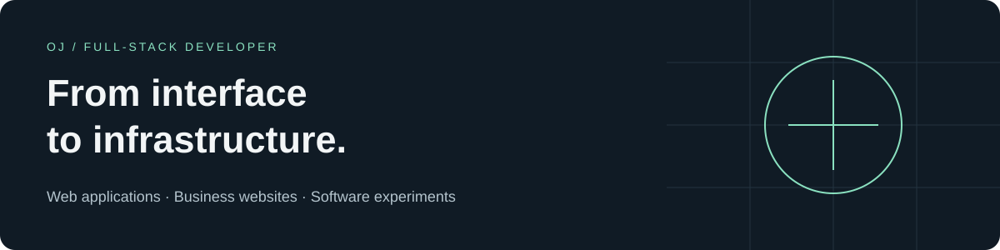
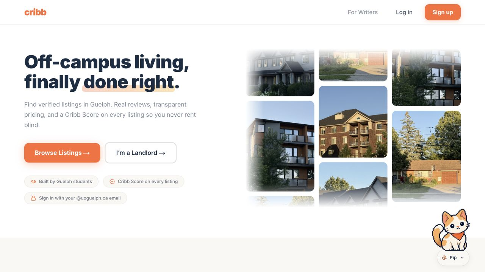
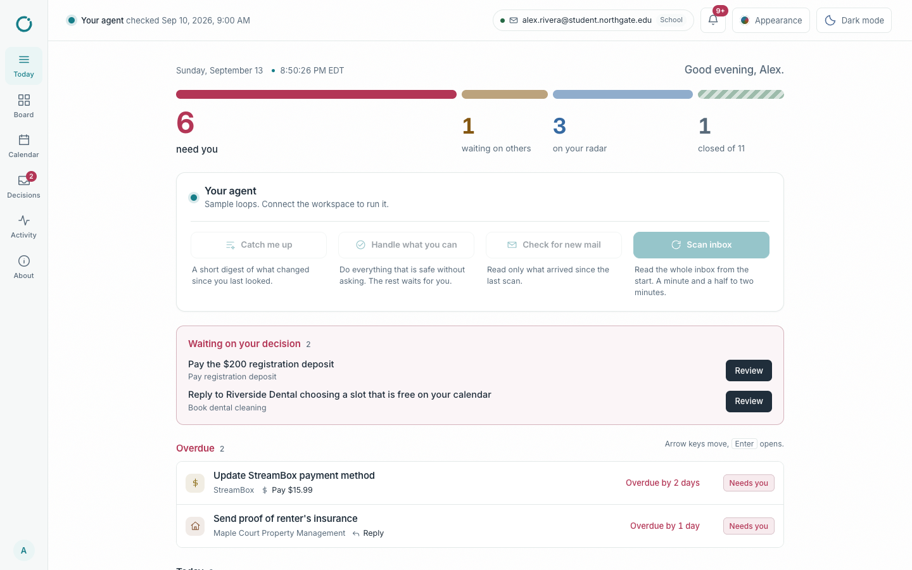
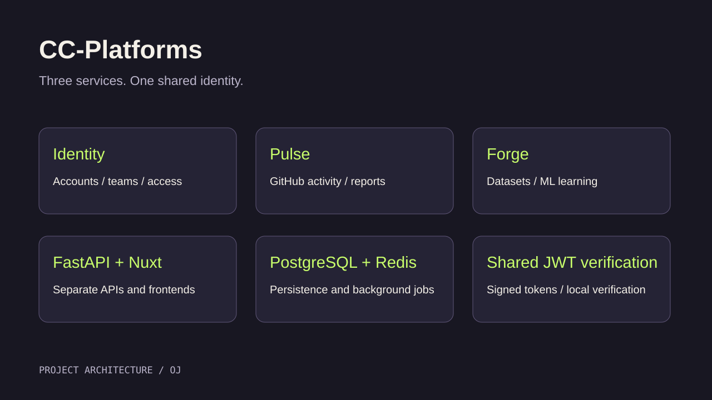
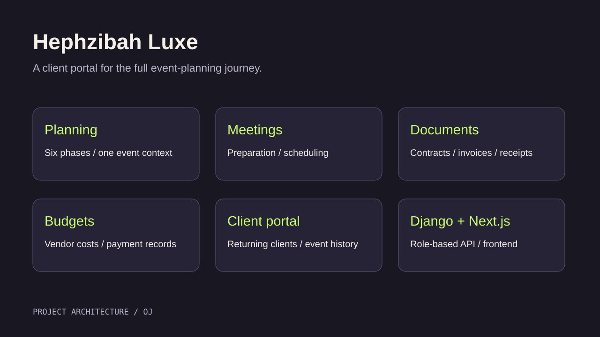
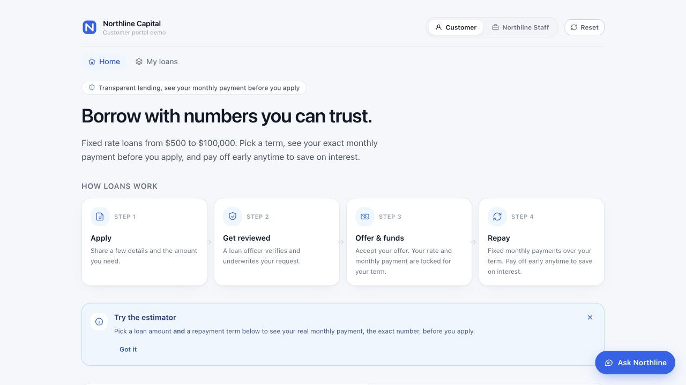
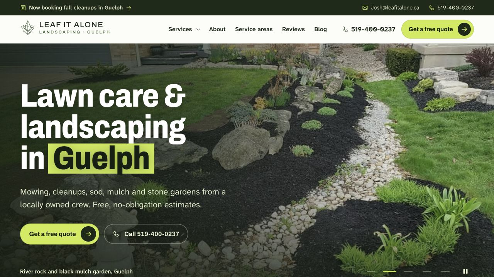

  

  <a href="#selected-projects"><strong>projects</strong></a> &nbsp; · &nbsp;
  <a href="assets/Adeoluwa-Ojulari-Resume.pdf"><strong>Resume</strong></a> &nbsp; · &nbsp;
  <a href="https://linkedin.com/in/adeoluwa-ojulari-5b4582271/"><strong>LinkedIn</strong></a> &nbsp; · &nbsp;
  <a href="mailto:adeoluwaojulari@gmail.com"><strong>Email</strong></a>

## Hi, I'm OJ ♧

I'm a **fourth-year Bachelor of Computing (Co-op) student at the University of Guelph**, with a minor in Business. My co-op work spans supply chain, energy, e-commerce, and consulting, with contributions to frontend features, backend services, and the work that connects them.

I build full-stack applications and business websites. My work includes the backend for Cribb, AI-assisted workflows, shared platform services, and client portals that bring scattered business processes into one place.

  
  
  
  
  
  
  
  
  
  
  
  
  
  
  
  
  

## Selected projects

<table>
<tr>
<td width="50%" valign="top">

### 01 / Cribb
**Student housing, with the backend to support it.**

I developed the backend for a student housing platform with listings, sublets, weighted roommate matching, and a marketplace. My work includes 100+ API endpoints, role-based authentication, viewing bookings and reminders, and landlord verification using AWS S3 and Textract.

**Stack:** Python · FastAPI · PostgreSQL · AWS S3 · Textract

**[Explore Cribb](https://findyourcribb.com)**

</td>
<td width="50%" valign="top">

### 02 / Open Loops
**An AI agent for responsibilities that need follow-through.**

A team project for the AWS Agents for Humans hackathon. The agent uses email and calendar evidence to track unresolved responsibilities, check whether they are already done, and prepare actions while keeping consequential decisions behind an approval step.

**Stack:** Next.js · TypeScript · Strands Agents · Bedrock · DynamoDB

**[Explore Open Loops](https://openloop-neon.vercel.app)** · [View source](https://github.com/Omggdavidd/openloops)

</td>
</tr>
<tr>
<td width="50%" valign="top">

### 03 / CC-Platforms
**Shared identity across reporting and ML learning tools.**

A service-based platform combining Identity for accounts and access, Pulse for GitHub activity and engineering reports, and Forge for no-code ML learning. Shared authentication and components connect separate APIs and frontends.

**Stack:** FastAPI · Nuxt · PostgreSQL · Redis · Docker

**[Explore CC-Platforms](https://github.com/Ojulari123/CC-Platforms)**

</td>
<td width="50%" valign="top">

### 04 / Hephzibah Luxe
**One workspace for an entire event-planning engagement.**

A full-stack event-planning platform with a client portal, a six-phase planning journey, meeting preparation, contracts, payment records, and vendor budgets. Separate client identities and event engagements preserve the history of returning clients.

**Stack:** Next.js · Django REST Framework · PostgreSQL · Redis · Cloudflare R2

**Demo available on request**

</td>
</tr>
<tr>
<td width="50%" valign="top">

### 05 / Loan Workflow
**Customer and staff views of a lending workflow.**

A lending simulator where customers estimate payments, submit applications, and follow repayment, while staff review applications and monitor the portfolio. Both roles share a MySQL-backed API with an AI-assisted underwriting assessment.

**Stack:** React · TypeScript · Spring Boot · Java · MySQL · Claude

**[Explore Loan Workflow](https://loan-workflow-one.vercel.app)** · [View source](https://github.com/Ojulari123/loan-workflow)

</td>
<td width="50%" valign="top">

### 06 / Leaf It Alone
**Local service content and a clear path to requesting a quote.**

A 28-page landscaping website with dedicated service pages, a project gallery, seasonal guidance, a blog, and a multi-step quote form. Built with Astro as a static site, with structured content and redirects for existing blog URLs.

**Stack:** Astro · TypeScript · HTML · CSS · Vercel

**[Explore Leaf It Alone](https://leafitalone.vercel.app)** · [View source](https://github.com/Ojulari123/leafitalone)

</td>
</tr>
</table>

## From my work terms

At **Value-N-Action Consulting**, I shipped the company website and built an AI agent platform with ten workflows across three agents. At **Badger Redwood**, I built full-stack supply chain features and dashboards using React, TypeScript, and Python. At **JREN Energy**, I contributed to the public website and Chilink conferencing app. At **RAA I.T.**, I developed customer-management features including authentication, role-based access, product workflows, and WebSocket chat.

[Read my work-term report](https://wkterm-report.vercel.app/) · [View my résumé](assets/Adeoluwa-Ojulari-Resume.pdf)

---

Have a project in mind, or want to talk about something I've built? [Email me](mailto:adeoluwaojulari@gmail.com) or [connect on LinkedIn](https://linkedin.com/in/adeoluwa-ojulari-5b4582271/).
