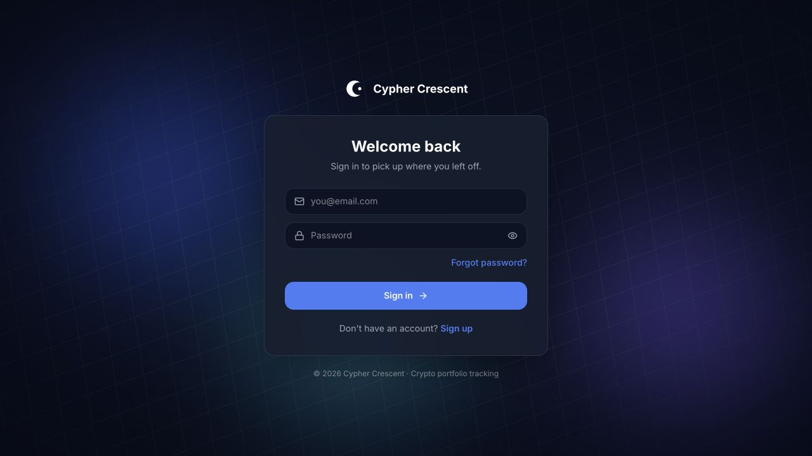
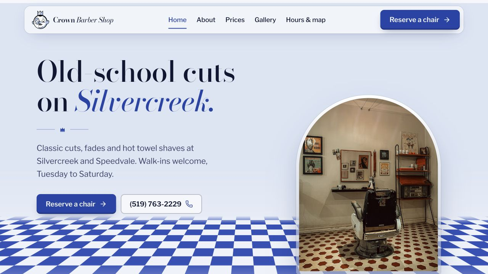

  

  <a href="#selected-projects"><strong>Explore my projects</strong></a> &nbsp; · &nbsp;
  <a href="https://linkedin.com/in/adeoluwa-ojulari-5b4582271/"><strong>LinkedIn</strong></a> &nbsp; · &nbsp;
  <a href="mailto:adeoluwaojulari@gmail.com"><strong>Email me</strong></a>

## Hi, I'm OJ ♧

I'm a **Computer Science student at the University of Guelph** and a **full-stack developer**. I build web applications and business websites, working across the interface, APIs, databases, and deployment.

My projects range from cryptocurrency portfolio tracking and loan workflow simulation to booking systems and local business websites. I'm also interested in browser performance, shared platform architecture, and making websites easier to find through search.

## Selected projects

<table>
<tr>
<td width="50%" valign="top">

### 01 / Cypher Crescent
**Cryptocurrency holdings, market data, and portfolio tracking.**

A full-stack app for recording holdings, following live prices, and tracking profit and loss. Includes watchlists, price alerts, Redis caching, and authentication with refresh-token rotation and optional email verification codes.

**Stack:** `Python` `FastAPI` `PostgreSQL` `Redis` `CoinGecko`

**[Open the app](https://cypher-crescent.vercel.app)** · [View source](https://github.com/Ojulari123/CypherCrescent)

</td>
<td width="50%" valign="top">

### 02 / Loan Workflow
**A lending simulator with customer and staff views.**

Customers can estimate payments, apply for a loan, and follow repayment. Staff can review applications and see the portfolio. Both views share a MySQL-backed API, with an AI-assisted underwriting assessment.

**Stack:** `React` `TypeScript` `Spring Boot` `Java` `MySQL` `Claude`

**[Explore the demo](https://loan-workflow-one.vercel.app)** · [View source](https://github.com/Ojulari123/loan-workflow)

</td>
</tr>
<tr>
<td width="50%" valign="top">

### 03 / Crown Barber Shop
**A shop website with a booking and management portal.**

A client demo that connects a public website to an admin workspace for chair requests, walk-ins, messages, prices, and hours. Includes an SMS outbox and reminder scheduling, with texts kept in dry-run mode for the demo.

**Stack:** `Next.js` `TypeScript` `FastAPI` `PostgreSQL` `Twilio`

**[Visit the demo](https://crown-barbershop-six.vercel.app)** · [View source](https://github.com/Ojulari123/crown-barbershop)

</td>
<td width="50%" valign="top">

### 04 / Leaf It Alone
**A service website built around local search and quote requests.**

A 28-page landscaping website with dedicated service pages, a project gallery, seasonal guidance, a blog, and a multi-step quote form. Built as a static site with structured content and redirects for existing blog URLs.

**Stack:** `Astro` `TypeScript` `HTML` `CSS` `Vercel`

**[Visit the website](https://leafitalone.vercel.app)** · [View source](https://github.com/Ojulari123/leafitalone)

</td>
</tr>
</table>

## Behind the interfaces

| Project | What it explores | Code |
| --- | --- | --- |
| **CypherCrescent Platforms** | Shared identity for engineering reporting and a no-code ML learning platform. Separate services use a common login system, shared components, and locally verified JWTs. | [Explore the platform](https://github.com/Ojulari123/CC-Platforms) |
| **JavaScript vs WebAssembly** | A browser benchmark suite comparing JavaScript algorithms with C++ compiled to WebAssembly. Uses seeded inputs, correctness checks, timing charts, and exportable results. | [Explore the research](https://github.com/Ojulari123/benchmark-suite) |
| **Automated Messaging Platform** | A team-built system for occasion messages, reusable templates, and admin-approved membership, with a FastAPI backend and SMS integration. | [Explore the system](https://github.com/Ojulari123/Automated-Messaging-Platform) |

## Tools I work with

**Frontend:** TypeScript · JavaScript · React · Next.js · Vue/Nuxt · Astro · Tailwind CSS  
**Backend & data:** Python · FastAPI · Java · Spring Boot · PostgreSQL · MySQL · Redis  
**Delivery & design:** Git · Docker · Vercel · Render · Figma

---

Have a project in mind, or want to talk about something I've built? [Email me](mailto:adeoluwaojulari@gmail.com) or [connect on LinkedIn](https://linkedin.com/in/adeoluwa-ojulari-5b4582271/).
